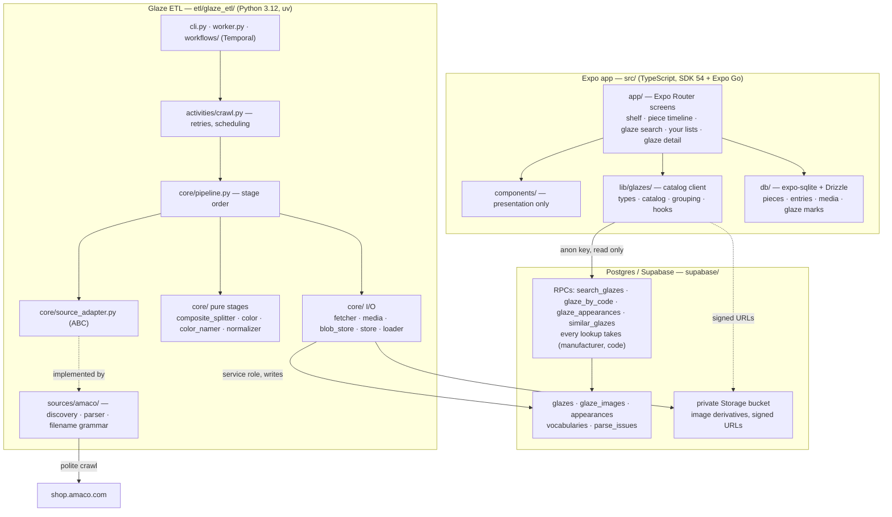

# Architecture

Two programs that never call each other. The Expo app is offline-first and owns your
pieces; the Python ETL is a scheduled scraper that owns the glaze catalog. Their only
shared surface is Postgres — specifically the RPC signatures in `supabase/migrations/`.

**Expo app (`src/`)** owns everything about *your* pottery, stored locally in SQLite so it
works with no signal and no account. It reads the glaze catalog over the anon key and never
writes to it. Wishlist/owned/favourite marks are deliberately local: the catalog has no idea
what you own, and should not.

A glaze is named by **`(manufacturer, code)`**, never by code alone — in the RPCs, in the
detail route, and in the local marks table. `glazes` has always been unique on that pair, and
two brands are free to spell a code the same way, so anything resolving a bare code was picking
a brand arbitrarily.

**Postgres (`supabase/`)** is the contract. Migrations are append-only history — the schema
changes by adding a migration, never by editing one. The three RPCs are the only shape the
app depends on, which is why they are hand-mirrored in `src/lib/glazes/types.ts` rather than
generated.

**Glaze ETL (`etl/`)** is a standalone uv project, excluded from the Metro bundle. Everything
manufacturer-specific lives behind `SourceAdapter`; a second manufacturer is one new subclass
plus its grammar, with no change to a stage, workflow, or table. The parse stage is pure — no
network, no clock, no database — which is what lets a reparse replay the whole corpus in
seconds.
